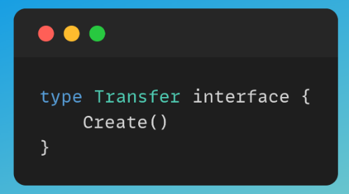
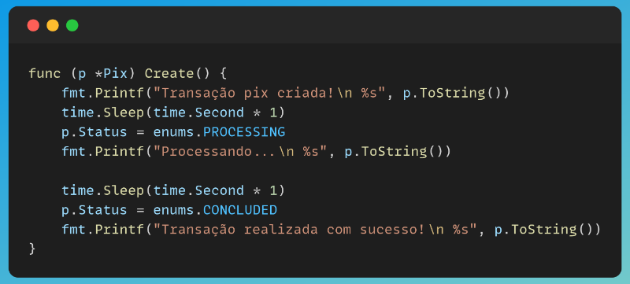
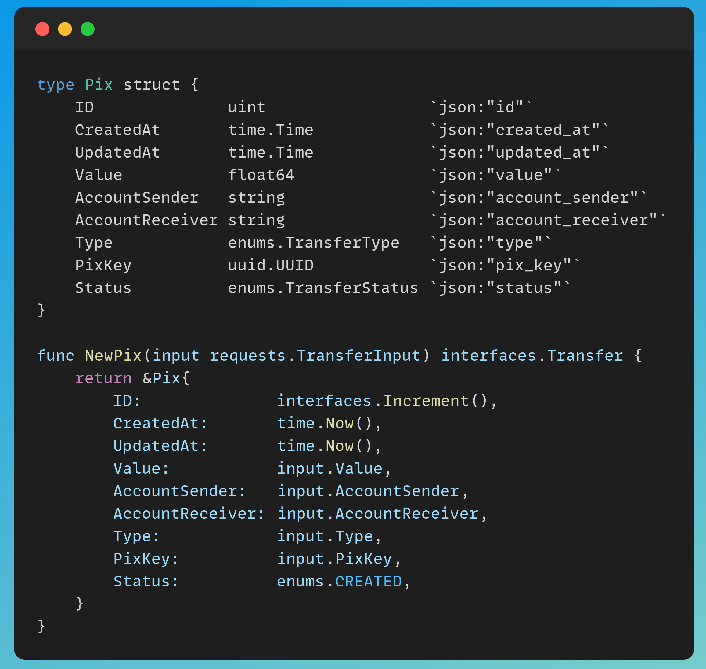
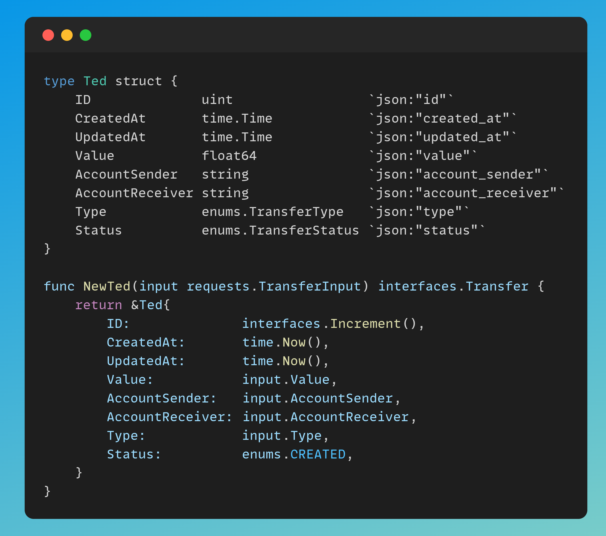

# Factory Method
--- 
## Foi desenvolvido uma estrutura básica, apenas para demonstrar como realizar a implementação de padrões no mundo real.
O Contexto, é a realização de transações, onde podemos ter alguns tipos de transações (PIX, TED entre outros), fazendo com que cada um siga um fluxo diferente, dependendo de qual seja escolhido.
---
1. Para implementar esse padrão, ambas as classes devem implementar a mesma interface, com métodos que fazem sentido em todas as transações, conforme mostrarei a seguir:
- Interface:

- Ted:

- Pix:

2. Para cada classe, deverá existir um construtor e um parâmetro de controle **(TransferType)**, para idêntificar qual tipo de transação será criada:

###### Lembrando que esse exemplo é bem superficial, apenas para demonstrar sua real utilização.
